# Benchmarks

Every number turbovec publishes comes from the scripts in
[`benchmarks/suite/`](../benchmarks/suite/), run on two fixed machines — a
GCP c4a-standard-8 (Google Axion, ARM) and a GCP c3-standard-8 (Intel Xeon
Platinum 8481C, Sapphire Rapids, x86) — on real embeddings: OpenAI
text-embedding-3 at d=1536 and d=3072 (DBpedia) and GloVe at d=200. The
raw results are the JSON files in [`benchmarks/results/`](../benchmarks/results/);
the charts are generated from them by `benchmarks/create_diagrams.py`. The
README's summary figures are derived from the same files.

## Recall

TurboQuant vs FAISS `IndexPQ` (LUT256, nbits=8) — the paper's Section 4.4 baseline. 100K vectors, k=64. FAISS PQ sub-quantizer counts sized to match TurboQuant's bit rate (m=d/4 at 2-bit, m=d/2 at 4-bit).

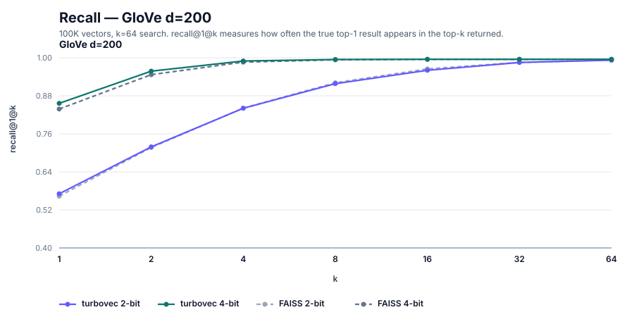

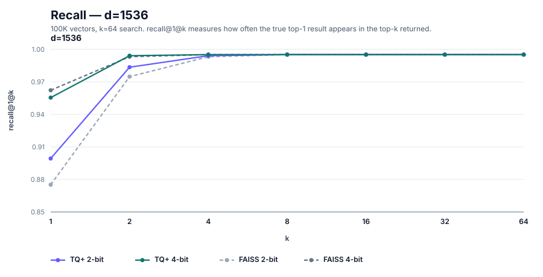

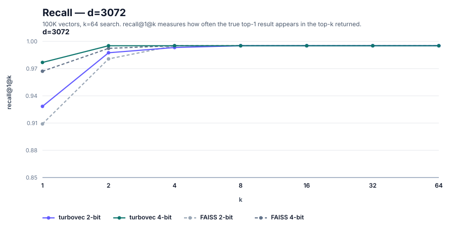

The turbovec series is the calibrated index (TQ+, `calibrate()` on a 1,024-row sample). Across OpenAI d=1536 and d=3072, TQ+ beats FAISS at R@1 on three of four cells (by 1.0–2.5 points; d=1536 4-bit trails by 0.7), and both reach 1.0 by k=8 (≥0.998 already at k≤4). GloVe d=200 is the harder regime — at low dim the asymptotic Beta assumption is looser. TQ+ lands ahead of FAISS at R@1 at both bit widths (+1.8 at 4-bit, +0.7 at 2-bit), with FAISS keeping a slim edge at 2-bit from k≈8. Uncalibrated numbers are in the JSONs (`tq_recalls`).

**A note on baselines.** We compare against FAISS `IndexPQ` (LUT256, nbits=8, float32 LUT) because it's the default production-grade PQ most users would reach for. This is a stronger baseline than the custom u8-LUT PQ in the [TurboQuant paper](https://arxiv.org/abs/2504.19874) — FAISS uses a higher-precision LUT at scoring time and k-means++ for codebook training. We reproduce the paper's TurboQuant numbers on OpenAI d=1536 / d=3072 and hit similar numbers to other community reference implementations on low-dim embeddings (see [`turboquant-py`](https://pypi.org/project/turboquant-py/) at d=384). On GloVe (d=200) — the low-dim regime where the asymptotic Beta assumption is loosest — TurboQuant lands ahead of FAISS at 4-bit but trails it at 2-bit; TQ+ calibration recovers the 2-bit deficit at R@1 (0.572 vs FAISS's 0.565), with FAISS keeping a slim edge at deeper k.

Full results: [d=1536 2-bit](../benchmarks/results/recall_d1536_2bit.json), [d=1536 4-bit](../benchmarks/results/recall_d1536_4bit.json), [d=3072 2-bit](../benchmarks/results/recall_d3072_2bit.json), [d=3072 4-bit](../benchmarks/results/recall_d3072_4bit.json), [GloVe 2-bit](../benchmarks/results/recall_glove_2bit.json), [GloVe 4-bit](../benchmarks/results/recall_glove_4bit.json).

## Compression

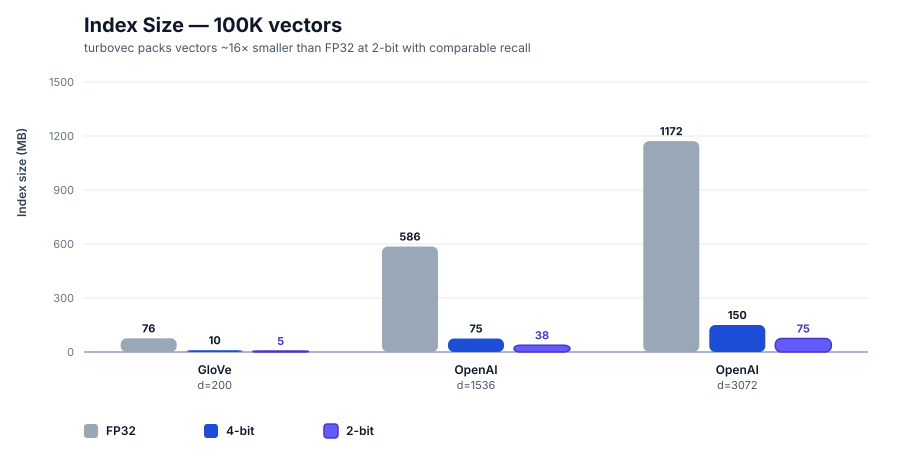

## Search Speed

All benchmarks: 100K vectors, 1K queries, k=64, median of 5 runs.

### ARM (GCP c4a-standard-8, Google Axion, 8 vCPUs)

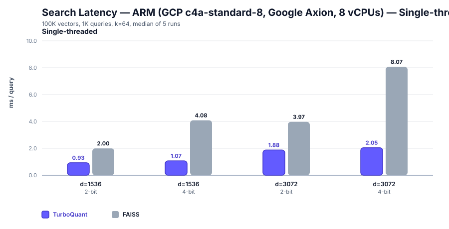

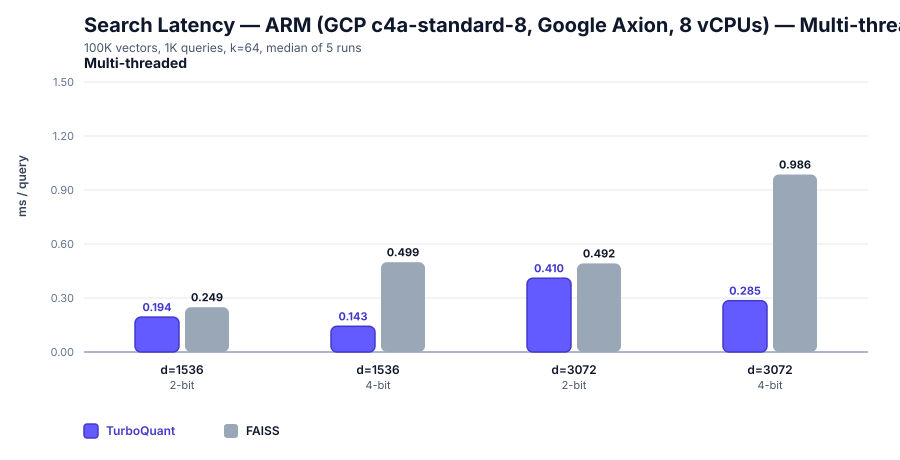

On ARM, TurboQuant beats FAISS FastScan in every config, averaging 4.0× at 4-bit (3.8–4.2× across cells — a staged search: the sign plane scanned with the table kernel, the shortlist ranked on the lower planes, the best rescored exactly) and 2.05× at 2-bit (1.8–2.2× — the same two-stage search over the sign and magnitude planes).

### x86 (Intel Xeon Platinum 8481C / Sapphire Rapids, 8 vCPUs)

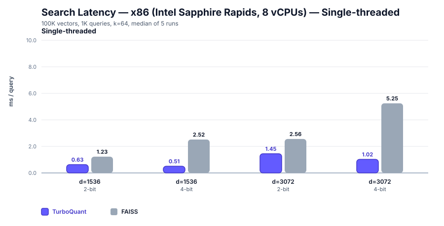

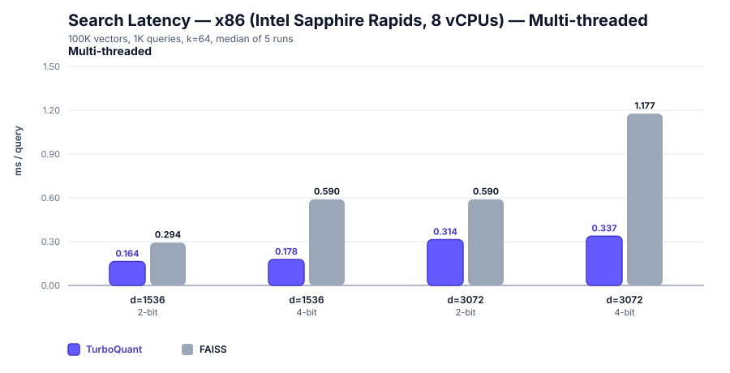

On x86, TurboQuant wins every config, averaging 4.9× at 4-bit (4.6–5.1× across cells — a staged search: the sign plane scanned with the AVX-512 VNNI kernel, the shortlist ranked by bit counts on the lower planes, the best rescored exactly) and 2.35× at 2-bit (2.2–2.5×, two-stage over the sign and magnitude planes, the `vpermb` LUT scan carrying the first stage).

## Insertion & Removal Latency

Same corpus as the search cells: 100K OpenAI vectors, median of 5 runs, timed loops including the Python-call overhead a caller actually pays per op. Insertion measures per-vector `add()` latency on a warm, populated index (built untimed) at n=1 — a single-vector `add()` — and n=100 — a 100-vector batch, showing how far batching amortizes the per-call overhead — against `add()` into the trained, populated FAISS `IndexPQFastScan` (training untimed). A single `add()` lands in 7.9–21.7 µs depending on the cell (6.3–12.6× faster than a FAISS single add), and a 100-vector batch amortizes TurboQuant to 5.6–17.8 µs/vector (4.5–13.8× faster than the same batch into FAISS). Removal measures per-op remove-by-id latency at n=1 (the steady per-op rate over 1000 removes) and n=100 (the first 100 removes on a fresh index): `IdMapIndex.remove(id)` — O(1) swap-and-pop plus the id-map bookkeeping — lands at 1.3–5.9 µs and 1.5–6.3 µs per op across the cells (since 1.0.0 a built index keeps the search layout alone, so a remove patches that layout in place; the planes layouts' rows patch cheaply). The FAISS column is the same user-visible operation, `remove_ids` on an `IndexIDMap` over `IndexPQFastScan`, which repacks the stored codes on every call: 0.19–1.03 s per single remove at 100K, with cost doubling alongside code size — which is why the removal charts use a log-scale axis. Charts show the single-threaded cells (`RAYON_NUM_THREADS=1`); the `_mt` cells are measured too and match at n=1, since a single add is serial. Scripts: [`benchmarks/suite/`](../benchmarks/suite/).

### ARM (GCP c4a-standard-8, Google Axion, 8 vCPUs)

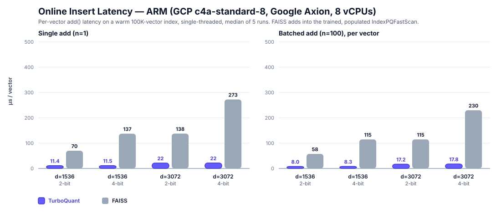

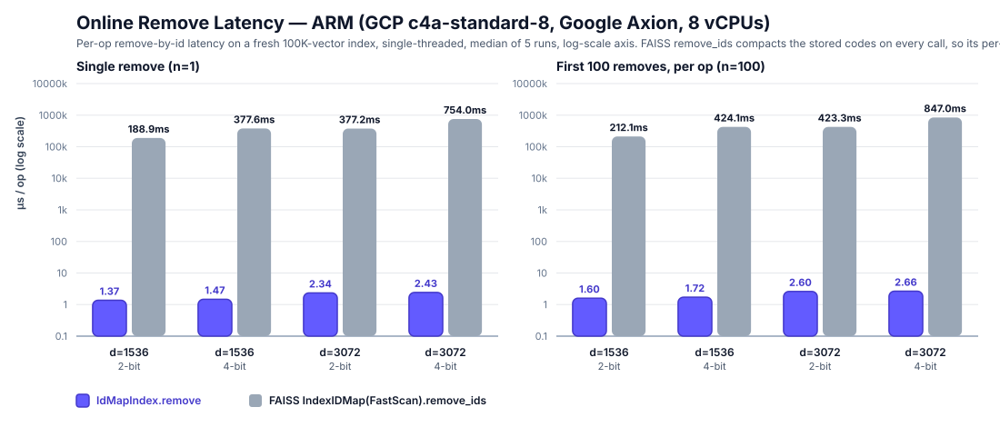

Full results: [d=1536 2-bit insert](../benchmarks/results/speed_insert_d1536_2bit_arm_st.json), [d=1536 4-bit insert](../benchmarks/results/speed_insert_d1536_4bit_arm_st.json), [d=3072 2-bit insert](../benchmarks/results/speed_insert_d3072_2bit_arm_st.json), [d=3072 4-bit insert](../benchmarks/results/speed_insert_d3072_4bit_arm_st.json), and the matching [`speed_remove_*`](../benchmarks/results/) and `_mt` files.

### x86 (Intel Xeon Platinum 8481C / Sapphire Rapids, 8 vCPUs)

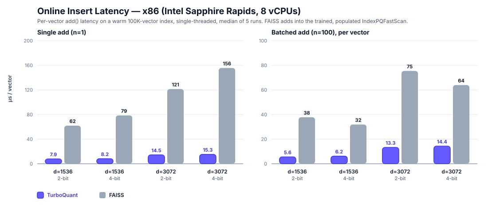

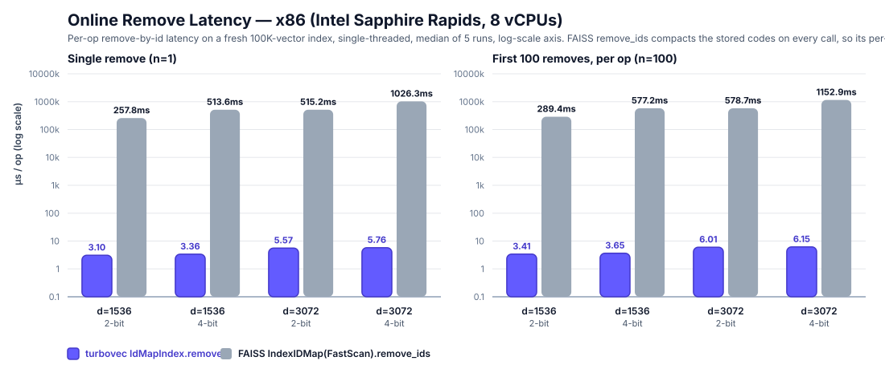

Full results: [d=1536 2-bit insert](../benchmarks/results/speed_insert_d1536_2bit_x86_st.json), [d=1536 4-bit insert](../benchmarks/results/speed_insert_d1536_4bit_x86_st.json), [d=3072 2-bit insert](../benchmarks/results/speed_insert_d3072_2bit_x86_st.json), [d=3072 4-bit insert](../benchmarks/results/speed_insert_d3072_4bit_x86_st.json), and the matching [`speed_remove_*`](../benchmarks/results/) and `_mt` files.

## Save & Load

Same corpus as the search cells: 100K OpenAI vectors, median of 5 runs. TurboQuant serializes to a single `.tv` file with an fsync + atomic rename; FAISS is `write_index` / `read_index` on the precision-matched `IndexPQFastScan` (sub-quantizer count matched to TurboQuant's bit rate, as in the search cells). **Save (warm)** is a write after a search has run, so the blocked layout cache is populated. **Load → first search** opens a fresh index and times the first query — separating bare deserialization (the page cache is warm throughout, so this is layout work, not cold-storage I/O) from the first-query cost. **Round-trip** chains the checkpoint/resume cycle an embedding store actually pays — mutate 1K vectors → save → reopen → serve the first query; FAISS has no measured equivalent for this path, so it is shown for TurboQuant only. On the smaller payloads the round-trip can come in *below* the isolated post-mutation ("dirty") write: the two are timed in separate suite steps, and at small file sizes the standalone `fsync` in the dirty-write step dominates and inflates it — a measurement artifact of the harness, not a repack win in the combined path. Single-threaded cells pin `RAYON_NUM_THREADS=1`. Scripts: [`benchmarks/suite/`](../benchmarks/suite/).

### ARM (GCP c4a-standard-8, Google Axion, 8 vCPUs)

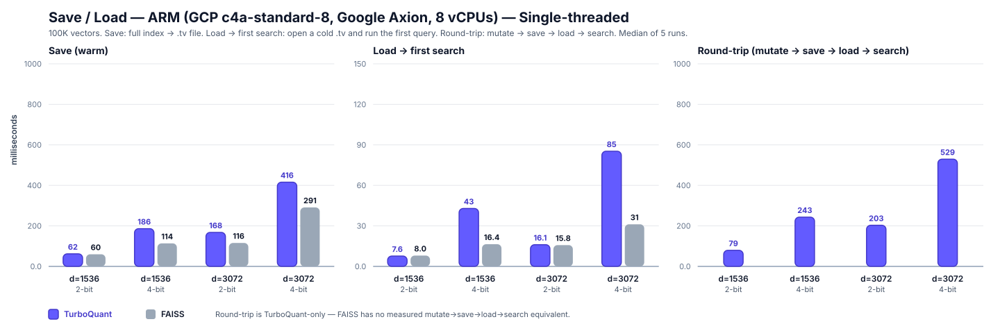

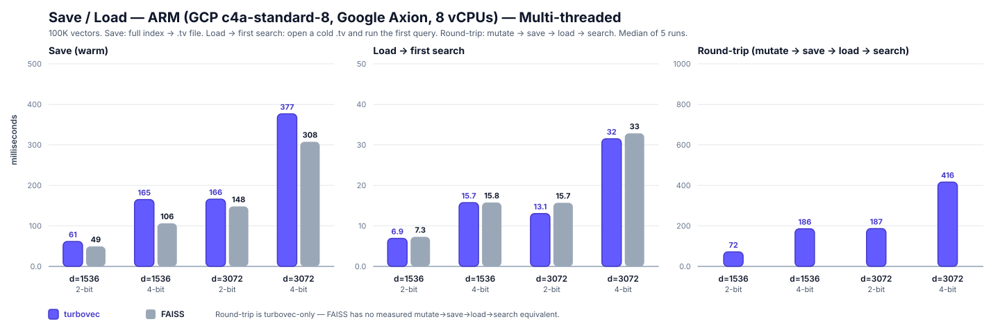

Full results: [d=1536 2-bit persist ST](../benchmarks/results/speed_persist_d1536_2bit_arm_st.json), [MT](../benchmarks/results/speed_persist_d1536_2bit_arm_mt.json), [d=1536 4-bit persist ST](../benchmarks/results/speed_persist_d1536_4bit_arm_st.json), [MT](../benchmarks/results/speed_persist_d1536_4bit_arm_mt.json), [d=3072 2-bit persist ST](../benchmarks/results/speed_persist_d3072_2bit_arm_st.json), [MT](../benchmarks/results/speed_persist_d3072_2bit_arm_mt.json), [d=3072 4-bit persist ST](../benchmarks/results/speed_persist_d3072_4bit_arm_st.json), [MT](../benchmarks/results/speed_persist_d3072_4bit_arm_mt.json).

### x86 (Intel Xeon Platinum 8481C / Sapphire Rapids, 8 vCPUs)

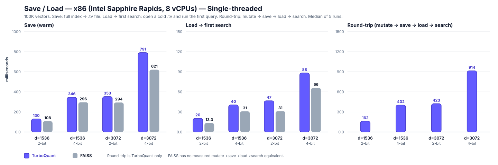

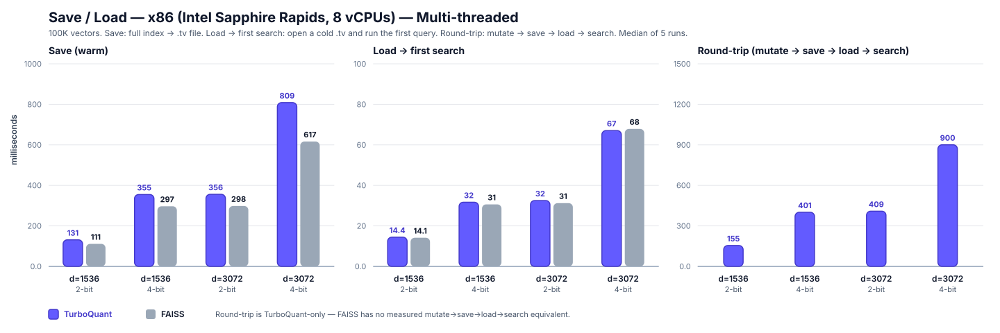

Full results: [d=1536 2-bit persist ST](../benchmarks/results/speed_persist_d1536_2bit_x86_st.json), [MT](../benchmarks/results/speed_persist_d1536_2bit_x86_mt.json), [d=1536 4-bit persist ST](../benchmarks/results/speed_persist_d1536_4bit_x86_st.json), [MT](../benchmarks/results/speed_persist_d1536_4bit_x86_mt.json), [d=3072 2-bit persist ST](../benchmarks/results/speed_persist_d3072_2bit_x86_st.json), [MT](../benchmarks/results/speed_persist_d3072_2bit_x86_mt.json), [d=3072 4-bit persist ST](../benchmarks/results/speed_persist_d3072_4bit_x86_st.json), [MT](../benchmarks/results/speed_persist_d3072_4bit_x86_mt.json).

## Running the suite yourself

Download datasets:
```bash
python3 benchmarks/download_data.py all            # all datasets
python3 benchmarks/download_data.py glove          # GloVe d=200
python3 benchmarks/download_data.py openai-1536    # OpenAI DBpedia d=1536
python3 benchmarks/download_data.py openai-3072    # OpenAI DBpedia d=3072
```

Each benchmark is a self-contained script in `benchmarks/suite/`. Run any one individually:
```bash
python3 benchmarks/suite/speed_d1536_2bit_arm_mt.py
python3 benchmarks/suite/recall_d1536_2bit.py
python3 benchmarks/suite/compression.py
```

Run all benchmarks for a category:
```bash
for f in benchmarks/suite/speed_*arm*.py; do python3 "$f"; done    # all ARM speed
for f in benchmarks/suite/speed_*x86*.py; do python3 "$f"; done    # all x86 speed
for f in benchmarks/suite/recall_*.py; do python3 "$f"; done       # all recall
python3 benchmarks/suite/compression.py                            # compression
```

Results are saved as JSON to `benchmarks/results/`. Regenerate charts:
```bash
python3 benchmarks/create_diagrams.py
```

### Quick harness for optimization work

The suite above is the source of every published number — real embeddings,
FAISS comparator, fixed shapes, run on the two official environments. For the
inner loop of an optimization pass there's also a Rust harness that reproduces
the four mutation metrics (cold bulk add, warm append, single add, remove) on
deterministic synthetic vectors, so a hypothesis can be measured in seconds on
any machine with no dataset and no FAISS:

```bash
cargo run --release --example insert_bench -- --dim 1536 --bits 2
RAYON_NUM_THREADS=1 cargo run --release --example insert_bench
```

It is a screening tool, not a source of published numbers.

`examples/encode_hash` prints a per-stage hash of the encode pipeline for a
fixed input; CI runs it on every OS in the matrix and fails if they disagree,
which is how cross-platform byte identity of the encode is checked.

